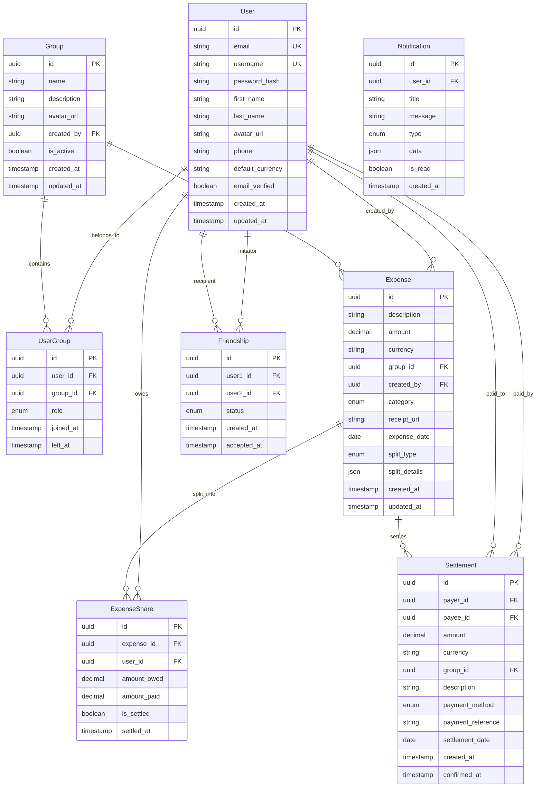

# Expense Sharing Application - Architecture Design

## System Overview

This document outlines the architecture for the CashKarma expense sharing application built with modern web technologies, focusing on scalability, security, and maintainability.

## Technology Stack

### Backend
- **Framework**: Node.js + Express.js
- **Database**: PostgreSQL with Prisma ORM
- **Authentication**: JWT + bcrypt
- **Caching**: Redis
- **File Storage**: AWS S3 (receipts, avatars)
- **Real-time**: Socket.io
- **API Documentation**: Swagger/OpenAPI

### Frontend
- **Web**: React + TypeScript + Tailwind CSS
- **Mobile**: React Native + TypeScript
- **State Management**: Zustand/Redux Toolkit
- **HTTP Client**: Axios with interceptors

### Infrastructure
- **Containerization**: Docker + Docker Compose
- **Monitoring**: Winston (logging) + Prometheus (metrics)
- **Testing**: Jest + Supertest
- **CI/CD**: GitHub Actions
- **Environment**: dotenv for configuration

## System Architecture

```
┌─────────────────┐    ┌─────────────────┐    ┌─────────────────┐
│   Web Client    │    │  Mobile Client  │    │  Admin Panel    │
│   (React TS)    │    │ (React Native)  │    │   (React TS)    │
└─────────┬───────┘    └─────────┬───────┘    └─────────┬───────┘
          │                      │                      │
          └──────────────────────┼──────────────────────┘
                                 │
                    ┌────────────┴────────────┐
                    │     Load Balancer       │
                    │      (Nginx/HAProxy)    │
                    └────────────┬────────────┘
                                 │
              ┌──────────────────┴──────────────────┐
              │              API Gateway            │
              │         (Express.js Router)         │
              └──────────────────┬──────────────────┘
                                 │
        ┌────────────────────────┼────────────────────────┐
        │                       │                        │
┌───────┴────────┐    ┌─────────┴────────┐    ┌─────────┴────────┐
│  Auth Service  │    │ Business Service │    │ Notification     │
│  - JWT tokens  │    │ - Groups/Friends │    │ Service          │
│  - User mgmt   │    │ - Expenses       │    │ - Socket.io      │
│  - Password    │    │ - Settlements    │    │ - Push notifs    │
│    reset       │    │ - Debt calc      │    │ - Email          │
└───────┬────────┘    └─────────┬────────┘    └─────────┬────────┘
        │                       │                        │
        └───────────────────────┼────────────────────────┘
                                │
                    ┌───────────┴────────────┐
                    │      Data Layer        │
                    └───────────┬────────────┘
                                │
        ┌───────────────────────┼───────────────────────┐
        │                       │                       │
┌───────┴────────┐    ┌─────────┴────────┐    ┌─────────┴────────┐
│   PostgreSQL   │    │      Redis       │    │      AWS S3      │
│   (Primary DB) │    │     (Cache)      │    │ (File Storage)   │
└────────────────┘    └──────────────────┘    └──────────────────┘
```

## Module Diagram

### Core Modules

```
src/
├── modules/
│   ├── auth/
│   │   ├── controllers/
│   │   ├── services/
│   │   ├── middlewares/
│   │   └── routes/
│   ├── users/
│   │   ├── controllers/
│   │   ├── services/
│   │   └── routes/
│   ├── groups/
│   │   ├── controllers/
│   │   ├── services/
│   │   └── routes/
│   ├── expenses/
│   │   ├── controllers/
│   │   ├── services/
│   │   └── routes/
│   ├── settlements/
│   │   ├── controllers/
│   │   ├── services/
│   │   └── routes/
│   └── notifications/
│       ├── controllers/
│       ├── services/
│       └── routes/
├── shared/
│   ├── database/
│   ├── utils/
│   ├── middlewares/
│   ├── types/
│   └── constants/
└── config/
    ├── database.ts
    ├── redis.ts
    ├── jwt.ts
    └── server.ts
```

## Database Schema (ER Diagram)

### Entity Relationships



## Database Tables Specification

### 1. users
```sql
CREATE TABLE users (
    id UUID PRIMARY KEY DEFAULT gen_random_uuid(),
    email VARCHAR(255) UNIQUE NOT NULL,
    username VARCHAR(50) UNIQUE NOT NULL,
    password_hash VARCHAR(255) NOT NULL,
    first_name VARCHAR(100) NOT NULL,
    last_name VARCHAR(100) NOT NULL,
    avatar_url TEXT,
    phone VARCHAR(20),
    default_currency CHAR(3) DEFAULT 'USD',
    email_verified BOOLEAN DEFAULT FALSE,
    created_at TIMESTAMP DEFAULT NOW(),
    updated_at TIMESTAMP DEFAULT NOW()
);
```

### 2. groups
```sql
CREATE TABLE groups (
    id UUID PRIMARY KEY DEFAULT gen_random_uuid(),
    name VARCHAR(255) NOT NULL,
    description TEXT,
    avatar_url TEXT,
    created_by UUID NOT NULL REFERENCES users(id),
    is_active BOOLEAN DEFAULT TRUE,
    created_at TIMESTAMP DEFAULT NOW(),
    updated_at TIMESTAMP DEFAULT NOW()
);
```

### 3. user_groups
```sql
CREATE TABLE user_groups (
    id UUID PRIMARY KEY DEFAULT gen_random_uuid(),
    user_id UUID NOT NULL REFERENCES users(id),
    group_id UUID NOT NULL REFERENCES groups(id),
    role VARCHAR(20) DEFAULT 'member', -- 'admin', 'member'
    joined_at TIMESTAMP DEFAULT NOW(),
    left_at TIMESTAMP,
    UNIQUE(user_id, group_id)
);
```

### 4. friendships
```sql
CREATE TABLE friendships (
    id UUID PRIMARY KEY DEFAULT gen_random_uuid(),
    user1_id UUID NOT NULL REFERENCES users(id),
    user2_id UUID NOT NULL REFERENCES users(id),
    status VARCHAR(20) DEFAULT 'pending', -- 'pending', 'accepted', 'blocked'
    created_at TIMESTAMP DEFAULT NOW(),
    accepted_at TIMESTAMP,
    CHECK (user1_id != user2_id),
    UNIQUE(user1_id, user2_id)
);
```

### 5. expenses
```sql
CREATE TABLE expenses (
    id UUID PRIMARY KEY DEFAULT gen_random_uuid(),
    description VARCHAR(255) NOT NULL,
    amount DECIMAL(12,2) NOT NULL,
    currency CHAR(3) NOT NULL,
    group_id UUID REFERENCES groups(id),
    created_by UUID NOT NULL REFERENCES users(id),
    category VARCHAR(50) DEFAULT 'general',
    receipt_url TEXT,
    expense_date DATE NOT NULL,
    split_type VARCHAR(20) NOT NULL, -- 'equal', 'unequal', 'percentage', 'shares'
    split_details JSONB,
    created_at TIMESTAMP DEFAULT NOW(),
    updated_at TIMESTAMP DEFAULT NOW()
);
```

### 6. expense_shares
```sql
CREATE TABLE expense_shares (
    id UUID PRIMARY KEY DEFAULT gen_random_uuid(),
    expense_id UUID NOT NULL REFERENCES expenses(id) ON DELETE CASCADE,
    user_id UUID NOT NULL REFERENCES users(id),
    amount_owed DECIMAL(12,2) NOT NULL,
    amount_paid DECIMAL(12,2) DEFAULT 0,
    is_settled BOOLEAN DEFAULT FALSE,
    settled_at TIMESTAMP,
    UNIQUE(expense_id, user_id)
);
```

### 7. settlements
```sql
CREATE TABLE settlements (
    id UUID PRIMARY KEY DEFAULT gen_random_uuid(),
    payer_id UUID NOT NULL REFERENCES users(id),
    payee_id UUID NOT NULL REFERENCES users(id),
    amount DECIMAL(12,2) NOT NULL,
    currency CHAR(3) NOT NULL,
    group_id UUID REFERENCES groups(id),
    description TEXT,
    payment_method VARCHAR(20) NOT NULL, -- 'cash', 'bank', 'paypal', 'venmo', etc.
    payment_reference VARCHAR(255),
    settlement_date DATE NOT NULL,
    created_at TIMESTAMP DEFAULT NOW(),
    confirmed_at TIMESTAMP
);
```

### 8. notifications
```sql
CREATE TABLE notifications (
    id UUID PRIMARY KEY DEFAULT gen_random_uuid(),
    user_id UUID NOT NULL REFERENCES users(id),
    title VARCHAR(255) NOT NULL,
    message TEXT NOT NULL,
    type VARCHAR(50) NOT NULL, -- 'expense_added', 'payment_received', 'friend_request'
    data JSONB,
    is_read BOOLEAN DEFAULT FALSE,
    created_at TIMESTAMP DEFAULT NOW()
);
```

## API Specification

### Authentication Endpoints
```
POST   /api/auth/register          # Register new user
POST   /api/auth/login             # User login
POST   /api/auth/logout            # User logout
POST   /api/auth/refresh           # Refresh JWT token
POST   /api/auth/forgot-password   # Request password reset
POST   /api/auth/reset-password    # Reset password with token
POST   /api/auth/verify-email      # Verify email address
```

### User Management
```
GET    /api/users/profile          # Get current user profile
PUT    /api/users/profile          # Update user profile
GET    /api/users/search           # Search users by email/username
POST   /api/users/upload-avatar    # Upload profile picture
```

### Friends Management
```
GET    /api/friends                # Get user's friends list
POST   /api/friends/request        # Send friend request
PUT    /api/friends/accept/:id     # Accept friend request
PUT    /api/friends/reject/:id     # Reject friend request
DELETE /api/friends/:id            # Remove friend
```

### Groups Management
```
GET    /api/groups                 # Get user's groups
POST   /api/groups                 # Create new group
GET    /api/groups/:id             # Get group details
PUT    /api/groups/:id             # Update group
DELETE /api/groups/:id             # Delete group
POST   /api/groups/:id/invite      # Invite user to group
POST   /api/groups/:id/leave       # Leave group
GET    /api/groups/:id/members     # Get group members
DELETE /api/groups/:id/members/:userId # Remove member
```

### Expenses Management
```
GET    /api/expenses               # Get user's expenses (with filters)
POST   /api/expenses               # Create new expense
GET    /api/expenses/:id           # Get expense details
PUT    /api/expenses/:id           # Update expense
DELETE /api/expenses/:id           # Delete expense
GET    /api/groups/:id/expenses    # Get group expenses
POST   /api/expenses/:id/upload-receipt # Upload receipt
```

### Balances & Settlements
```
GET    /api/balances               # Get user's balances summary
GET    /api/balances/detailed      # Get detailed balance breakdown
GET    /api/balances/optimized     # Get optimized payment suggestions
POST   /api/settlements            # Record a payment
GET    /api/settlements            # Get settlement history
PUT    /api/settlements/:id/confirm # Confirm payment received
```

### Notifications
```
GET    /api/notifications          # Get user notifications
PUT    /api/notifications/:id/read # Mark notification as read
PUT    /api/notifications/read-all # Mark all as read
DELETE /api/notifications/:id      # Delete notification
```

## Security Implementation

### JWT Strategy
```typescript
// JWT Configuration
const jwtConfig = {
  accessTokenSecret: process.env.JWT_ACCESS_SECRET,
  refreshTokenSecret: process.env.JWT_REFRESH_SECRET,
  accessTokenExpiry: '15m',
  refreshTokenExpiry: '7d',
  issuer: 'cashkarma-app',
  audience: 'cashkarma-users'
};
```

### Middleware Stack
```typescript
// Security middleware
app.use(helmet()); // Security headers
app.use(cors(corsOptions)); // CORS configuration
app.use(rateLimit(rateLimitConfig)); // Rate limiting
app.use(expressValidator()); // Input validation
app.use(authMiddleware); // JWT verification
app.use(rbacMiddleware); // Role-based access control
```

### Password Security
```typescript
// Password hashing with bcrypt
const saltRounds = 12;
const hashedPassword = await bcrypt.hash(password, saltRounds);
```

## Sprint Roadmap

### Sprint 1-2: Foundation (2-3 weeks)
**Goals**: Set up core infrastructure and basic user management

**Backend Tasks**:
- [ ] Project setup (Express, PostgreSQL, Redis)
- [ ] Database schema creation and migrations
- [ ] User authentication system (register, login, JWT)
- [ ] Basic user profile management
- [ ] Email verification system
- [ ] Password reset functionality
- [ ] Basic API documentation with Swagger

**Frontend Tasks**:
- [ ] React app setup with TypeScript and Tailwind
- [ ] Authentication pages (login, register, forgot password)
- [ ] Basic user profile page
- [ ] HTTP client setup with Axios interceptors
- [ ] Basic routing and navigation

**Testing & DevOps**:
- [ ] Unit tests for authentication
- [ ] Docker setup for development
- [ ] CI/CD pipeline setup

### Sprint 3-4: Social Features (2-3 weeks)
**Goals**: Implement friends and groups functionality

**Backend Tasks**:
- [ ] Friends system (add, accept, remove friends)
- [ ] Groups CRUD operations
- [ ] Group membership management
- [ ] Group invitation system
- [ ] User search functionality

**Frontend Tasks**:
- [ ] Friends management interface
- [ ] Group creation and management pages
- [ ] Group member management
- [ ] User search and invitation system
- [ ] Navigation updates

**Testing**:
- [ ] Integration tests for social features
- [ ] API endpoint testing

### Sprint 5-6: Core Expense Management (3-4 weeks)
**Goals**: Implement expense creation and splitting logic

**Backend Tasks**:
- [ ] Expense CRUD operations
- [ ] Multiple split types (equal, unequal, percentage, shares)
- [ ] Expense sharing calculations
- [ ] Receipt upload functionality
- [ ] Multi-currency support
- [ ] Expense categories

**Frontend Tasks**:
- [ ] Expense creation forms with all split types
- [ ] Expense list and detail views
- [ ] Receipt upload component
- [ ] Currency selection and conversion
- [ ] Category management

**Testing**:
- [ ] Comprehensive tests for calculation logic
- [ ] Split scenarios testing

### Sprint 7-8: Balance & Settlement System (2-3 weeks)
**Goals**: Implement balance calculations and payment tracking

**Backend Tasks**:
- [ ] Balance calculation engine
- [ ] Debt simplification algorithm
- [ ] Settlement recording system
- [ ] Payment confirmation workflow
- [ ] Balance summary APIs

**Frontend Tasks**:
- [ ] Balance dashboard
- [ ] Payment suggestion interface
- [ ] Settlement recording forms
- [ ] Payment history views
- [ ] Debt simplification visualization

**Testing**:
- [ ] Balance calculation accuracy tests
- [ ] Settlement workflow tests

### Sprint 9-10: Notifications & Polish (2 weeks)
**Goals**: Add notifications and improve UX

**Backend Tasks**:
- [ ] Notification system (in-app)
- [ ] Email notifications
- [ ] Real-time updates with Socket.io
- [ ] Activity logging
- [ ] Performance optimization

**Frontend Tasks**:
- [ ] Notification center
- [ ] Real-time updates
- [ ] Activity feed
- [ ] Mobile responsiveness improvements
- [ ] Loading states and error handling

**Testing**:
- [ ] End-to-end testing
- [ ] Performance testing
- [ ] Security testing

### Sprint 11-12: Mobile App (3-4 weeks)
**Goals**: React Native mobile application

**Mobile Development**:
- [ ] React Native project setup
- [ ] Shared components and logic
- [ ] Authentication flow
- [ ] Core functionality porting
- [ ] Push notifications
- [ ] Platform-specific optimizations

**Testing & Deployment**:
- [ ] Mobile app testing
- [ ] App store preparation
- [ ] Production deployment

## Performance Considerations

### Database Optimization
```sql
-- Key indexes for performance
CREATE INDEX idx_expenses_group_created ON expenses(group_id, created_at DESC);
CREATE INDEX idx_expense_shares_user ON expense_shares(user_id, is_settled);
CREATE INDEX idx_settlements_users ON settlements(payer_id, payee_id);
CREATE INDEX idx_notifications_user_unread ON notifications(user_id, is_read);
```

### Caching Strategy
```typescript
// Redis caching for frequent queries
const cacheKeys = {
  userBalance: (userId: string) => `balance:${userId}`,
  groupExpenses: (groupId: string) => `expenses:${groupId}`,
  userNotifications: (userId: string) => `notifications:${userId}`
};
```

### API Response Optimization
```typescript
// Pagination and filtering
const getExpenses = async (req: Request) => {
  const { page = 1, limit = 20, groupId, category } = req.query;
  // Implement cursor-based pagination for better performance
};
```

## Monitoring & Logging

### Application Logging
```typescript
// Winston configuration
const logger = winston.createLogger({
  level: 'info',
  format: winston.format.combine(
    winston.format.timestamp(),
    winston.format.errors({ stack: true }),
    winston.format.json()
  ),
  transports: [
    new winston.transports.File({ filename: 'error.log', level: 'error' }),
    new winston.transports.File({ filename: 'combined.log' })
  ]
});
```

### Health Checks
```typescript
// Health check endpoint
app.get('/health', async (req, res) => {
  const checks = {
    database: await checkDatabase(),
    redis: await checkRedis(),
    external_apis: await checkExternalServices()
  };
  res.json({ status: 'ok', timestamp: new Date(), checks });
});
```

This architecture provides a solid foundation for building a scalable, secure expense sharing application with room for future enhancements like advanced analytics, expense categories, recurring expenses, and integration with banking APIs.